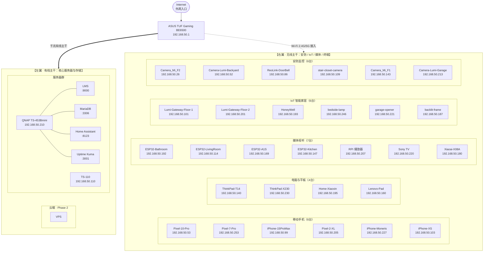

<!--
  本文件由 vars/topology.yml 自动渲染，请勿手改
  渲染命令：ansible-playbook site.yml --tags topology
  输出为 Markdown（含 mermaid 代码块），推到 GitHub 后自动成图
-->

```mermaid
flowchart TD
    Internet([Internet<br/>外网入口])
    D1["ASUS TUF Gaming BE6500<br/>192.168.50.1"]
    Internet --> D1

    subgraph Wired ["【左翼 · 有线主干：核心服务器与存储】"]
        direction TB
        subgraph SG_Server ["服务器群"]
            direction LR
            D2["QNAP TS-453Bmini<br/>192.168.50.210"]
            D3["LMS<br/>:9000"]
            D2 --- D3
            D4["MariaDB<br/>:3306"]
            D2 --- D4
            D5["Home Assistant<br/>:8123"]
            D2 --- D5
            D6["Uptime Kuma<br/>:3001"]
            D2 --- D6
            D7["TS-110<br/>192.168.50.110"]
        end

        subgraph SG_Cloud ["云端 · Phase 2"]
            D8["VPS"]
        end
        SG_Server ~~~ SG_Cloud
    end

    subgraph Wireless ["【右翼 · 无线主干：安防 / IoT / 媒体 / 终端】"]
        direction TB
        subgraph SG_Sec ["安防监控（6台）"]
            direction LR
            D9["Camera_Mi_F2<br/>192.168.50.26"]
            D10["Camera-Lumi-Backyard<br/>192.168.50.52"]
            D11["ReoLink-DoorBell<br/>192.168.50.86"]
            D12["stair-closet-camera<br/>192.168.50.109"]
            D13["Camera_Mi_F1<br/>192.168.50.143"]
            D14["Camera-Lumi-Garage<br/>192.168.50.213"]
            D9 ~~~ D10 ~~~ D11 ~~~ D12 ~~~ D13 ~~~ D14
        end
        subgraph SG_IoT ["IoT 智能家居（6台）"]
            direction LR
            D15["Lumi-Gateway-Floor-1<br/>192.168.50.101"]
            D16["Lumi-Gateway-Floor-2<br/>192.168.50.201"]
            D17["HoneyWell<br/>192.168.50.193"]
            D18["bedside-lamp<br/>192.168.50.246"]
            D19["garage-opener<br/>192.168.50.221"]
            D20["backlit-frame<br/>192.168.50.187"]
            D15 ~~~ D16 ~~~ D17 ~~~ D18 ~~~ D19 ~~~ D20
        end
        subgraph SG_Media ["媒体视听（7台）"]
            direction LR
            D21["ESP32-Bathroom<br/>192.168.50.192"]
            D22["ESP32-LivingRoom<br/>192.168.50.114"]
            D23["ESP32-A1S<br/>192.168.50.169"]
            D24["ESP32-Kitchen<br/>192.168.50.147"]
            D25["RPI 播放器<br/>192.168.50.207"]
            D26["Sony TV<br/>192.168.50.220"]
            D27["Xiaoai-X08A<br/>192.168.50.180"]
            D21 ~~~ D22 ~~~ D23 ~~~ D24 ~~~ D25 ~~~ D26 ~~~ D27
        end
        subgraph SG_PC ["电脑与平板（4台）"]
            direction LR
            D28["ThinkPad-T14<br/>192.168.50.140"]
            D29["ThinkPad-X230<br/>192.168.50.230"]
            D30["Home-Xiaoxin<br/>192.168.50.195"]
            D31["Lenovo-Pad<br/>192.168.50.160"]
            D28 ~~~ D29 ~~~ D30 ~~~ D31
        end
        subgraph SG_Mobile ["移动手机（6台）"]
            direction LR
            D32["Pixel-10-Pro<br/>192.168.50.53"]
            D33["Pixel-7-Pro<br/>192.168.50.253"]
            D34["iPhone-15ProMax<br/>192.168.50.99"]
            D35["Pixel-2-XL<br/>192.168.50.205"]
            D36["iPhone-Moneris<br/>192.168.50.227"]
            D37["iPhone-XS<br/>192.168.50.103"]
            D32 ~~~ D33 ~~~ D34 ~~~ D35 ~~~ D36 ~~~ D37
        end

        SG_Sec ~~~ SG_IoT ~~~ SG_Media ~~~ SG_PC ~~~ SG_Mobile
    end

    D1 ==>|千兆有线主干| Wired
    D1 -.->|Wi-Fi 2.4G/5G 接入| Wireless

    classDef warn fill:#fef2f2,stroke:#ef4444,color:#991b1b;
```
